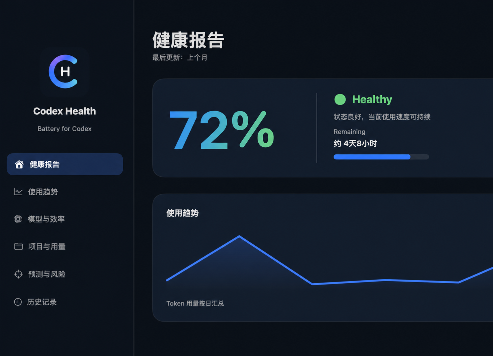
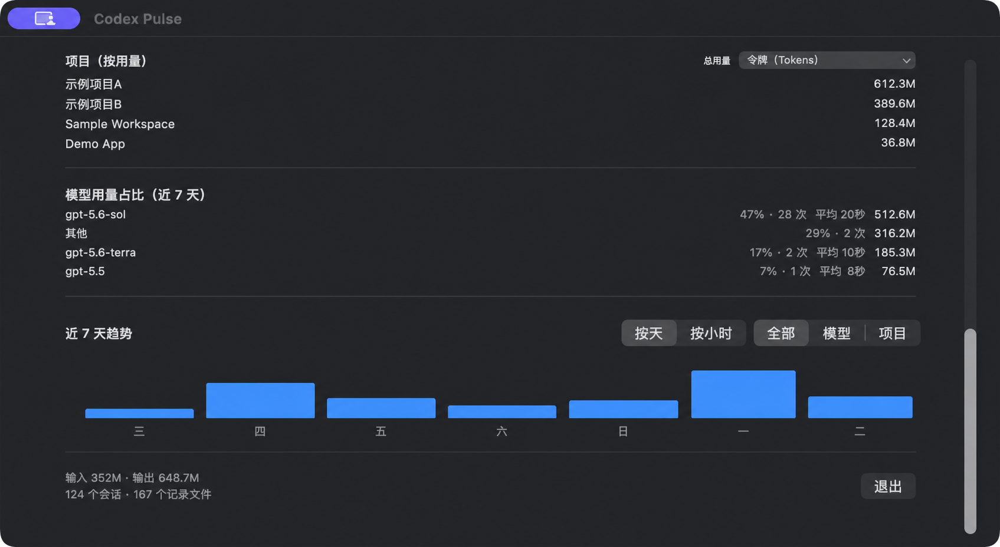

# CodexMeter

一个原生 macOS 菜单栏应用和桌面小组件，用于从本机 Codex 会话记录中查看 Token 用量、上下文与 7 天额度。

> 数据只在本机读取与计算，不上传会话内容或用量数据。



## 功能

- 菜单栏显示 7 天额度剩余百分比，并按剩余量变色：≥ 50% 为绿色、20%–49% 为黄色、< 20% 为红色
- 今日、近 7 天、本月 Token 用量，以及输入、输出、缓存和推理 Token 分类
- 当前会话上下文进度与 7 天额度重置倒计时
- 用量预测：按近 1 / 6 / 24 小时额度变化加权估算
- 项目排名支持今日、7 天、30 天切换
- 模型占比、请求次数与端到端平均轮次耗时
- 按日 / 按小时趋势，可按模型或项目筛选
- 低额度、预计提前耗尽、即将重置提醒；阈值和同日去重均可配置
- WidgetKit 桌面小组件：小号展示额度概览，中号展示三段用量、额度与上下文



## 使用

1. 打开 `dist/CodexMeter.app`。
2. 第一次启动时，选择你的 Codex 数据目录（通常为 `~/.codex`）。
3. 点击菜单栏图标查看摘要；选择“打开详情”查看完整分析。
4. 在桌面编辑模式中添加“Codex 用量”小组件。

应用会将已授权的数据目录保存为 macOS 安全书签，因此重新启动后仍可访问。

## 构建

环境要求：macOS 14+、Xcode 16+、一个可用于本机调试的 Apple Development 签名身份。

```bash
git clone https://github.com/niujt/CodexMeter.git
cd CodexMeter
ruby tools/generate_xcode_project.rb
xcodebuild -project CodexMeter.xcodeproj -scheme CodexMeter -configuration Debug -derivedDataPath build build
ditto build/Build/Products/Debug/CodexMeter.app dist/CodexMeter.app
open dist/CodexMeter.app
```

开发时也可以执行：

```bash
./script/build_and_run.sh
```

## 数据与限制

- 用量来自本机 `.codex` 下的会话 JSONL 记录；不同版本的 Codex 记录格式变化可能影响统计。
- “平均耗时”是从用户消息到后续助手消息的端到端轮次耗时，不是服务端 API 延迟。
- 额度预测依赖本机积累的额度历史，样本较少时会回退到当前周期平均速度。
- 这是一个非官方的本地辅助工具，与 OpenAI/Codex 没有隶属关系。

## 隐私

CodexMeter 不会上传 `.codex` 目录、会话内容或统计数据。小组件通过 App Group 读取应用写入的本地摘要缓存。
