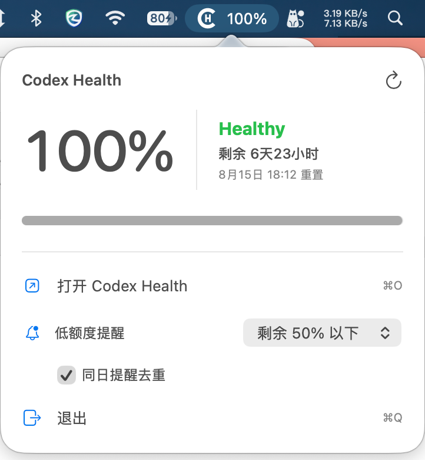
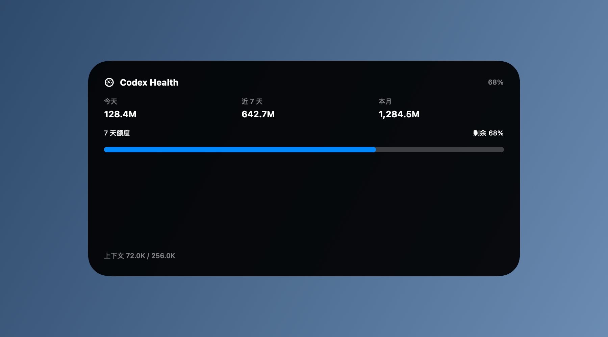
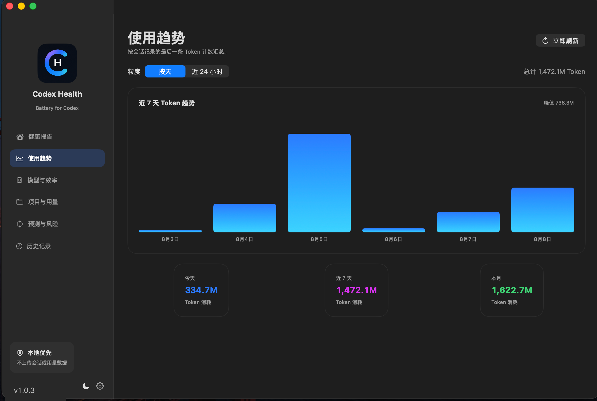
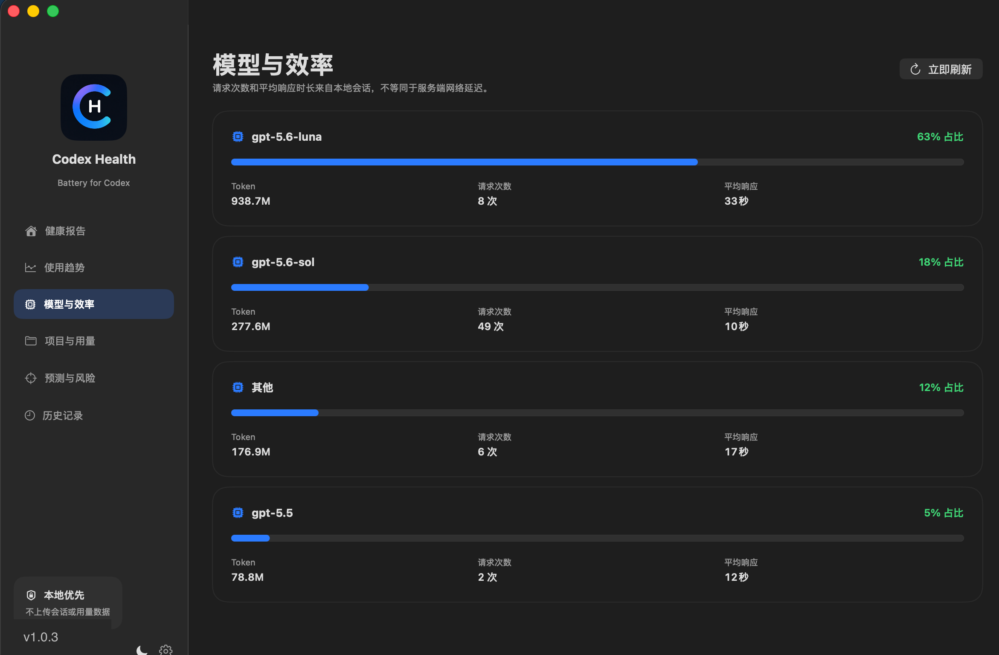
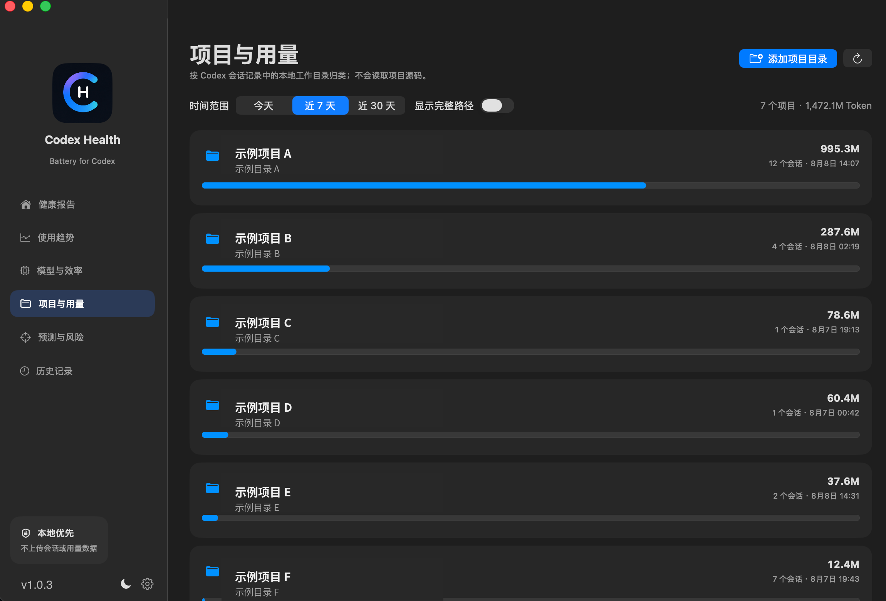
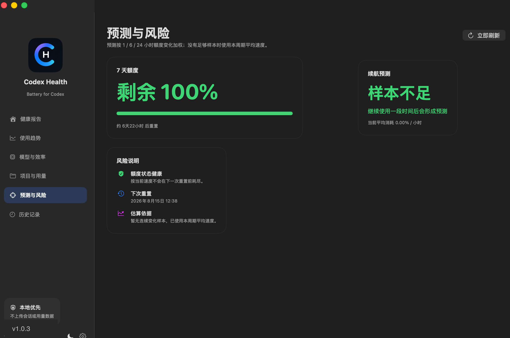
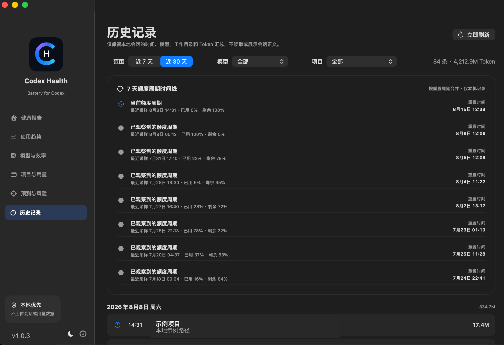

# Codex Health

一个原生 macOS 菜单栏应用和桌面小组件，用于从本机 Codex 会话记录中查看 Token 用量、上下文与 7 天额度。

> 数据只在本机读取与计算，不上传会话内容或用量数据。

## 下载

从 [GitHub Releases](https://github.com/niujt/CodexMeter/releases/latest) 下载最新版 DMG，打开后将 `Codex Health.app` 拖入 Applications。

当前发布包使用本机开发签名以确保 WidgetKit 扩展能被 macOS 识别；macOS 首次打开时可能提示无法验证开发者。请前往“系统设置 → 隐私与安全性”，在页面底部找到 Codex Health 的提示后选择“仍要打开”。

以下截图均为脱敏的演示数据，不包含真实项目、会话或 Token 用量。

## 健康报告


## 菜单栏摘要

菜单栏会显示当前 7 天额度剩余比例；点击后可快速查看额度、预测、提醒阈值并打开完整详情。



## 桌面小组件

在 macOS 桌面编辑模式中添加“Codex Health”小组件。小号展示额度概览，中号同时展示三段 Token 用量、7 天额度与当前上下文。



如果之前安装过旧版临时签名包，请先退出并移除 `/Applications/Codex Health.app`，再安装最新版并启动一次，然后重新打开桌面小组件编辑器搜索“Codex Health”。

## 使用趋势



## 模型与效率



## 项目与用量



## 预测与风险



## 历史记录



## 功能

- 菜单栏以白色图标和文字显示 7 天额度剩余百分比
- 今日、近 7 天、本月 Token 用量，以及输入、输出、缓存和推理 Token 分类
- 当前会话上下文进度与 7 天额度重置倒计时
- 用量预测：按近 1 / 6 / 24 小时额度变化加权估算
- 项目排名支持今日、7 天、30 天切换
- 模型占比、请求次数与端到端平均轮次耗时
- 按日 / 按小时趋势，可按模型或项目筛选
- 低额度、预计提前耗尽、即将重置提醒；阈值和同日去重均可配置
- WidgetKit 桌面小组件：小号展示额度概览，中号展示三段用量、额度与上下文

## 使用

1. 打开 `dist/Codex Health.app`。
2. 第一次启动时，选择你的 Codex 数据目录（通常为 `~/.codex`）。
3. 点击菜单栏图标查看摘要；选择“打开详情”查看完整分析。
4. 在桌面编辑模式中添加“Codex Health”小组件。

应用会将已授权的数据目录保存为 macOS 安全书签，因此重新启动后仍可访问。

## 构建

环境要求：macOS 14+、Xcode 16+。发布脚本会自动使用本机 Apple Development 证书为应用和 WidgetKit 扩展签名；没有开发证书时才回退到临时签名（此模式下小组件可能不会出现在 macOS 选择器中）。

```bash
git clone https://github.com/niujt/CodexMeter.git
cd CodexMeter
./script/build_distribution.sh
```

如需强制使用临时签名进行本地测试，可执行 `SIGNING_MODE=adhoc ./script/build_distribution.sh`。

开发调试时可以执行：

```bash
./script/build_and_run.sh
```

## 数据与限制

- 用量来自本机 `.codex` 下的会话 JSONL 记录；不同版本的 Codex 记录格式变化可能影响统计。
- “平均耗时”是从用户消息到后续助手消息的端到端轮次耗时，不是服务端 API 延迟。
- 额度预测依赖本机积累的额度历史，样本较少时会回退到当前周期平均速度。
- 这是一个非官方的本地辅助工具，与 OpenAI/Codex 没有隶属关系。

## 隐私

Codex Health 不会上传 `.codex` 目录、会话内容或统计数据。小组件通过 App Group 读取应用写入的本地摘要缓存。
